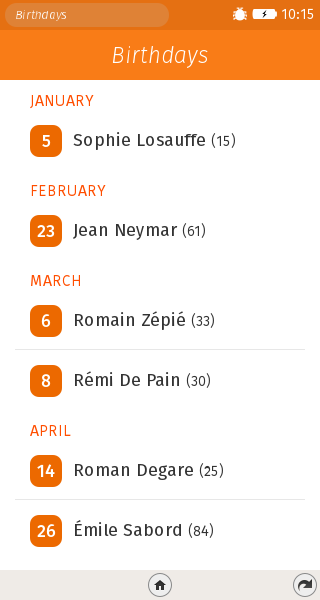
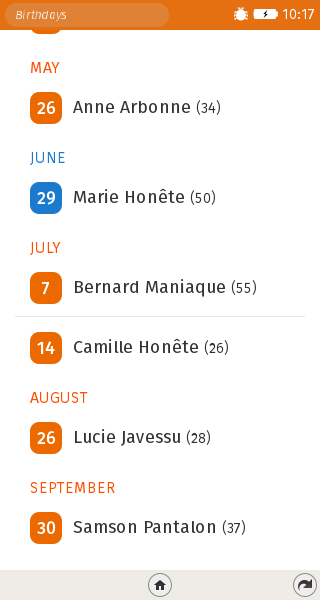
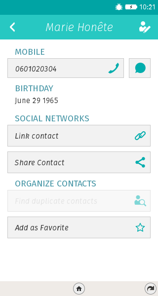

=============
Birthdays App
=============

A simple Firefox OS app which displays the birthdays of the user contacts.

This opensource app is freely available under a BSD license, copyright Pierre Haessig.
Note that the source tree includes gaia style files included in the `css/style` directory.
These styling files are distributed by the Mozilla Foundation under an Apache 2.0 license (https://github.com/mozilla-b2g/gaia/blob/master/LICENSE).

Screenshot
----------

All contacts which have a birthday appear in a month/day list:

Current month is highlighted:

Contact can be opened with a click, to whish them a happy birthday
with a call or a text message:

Background information
----------------------

I primarily created this app to discover some specifities of Firefox OS apps development.
These specifities are:

* Web API for reading the list of contacts
* Web Activity API for opening a contact
* Gaia style, for header and lists

Contributions
-------------

* Italian and Esperanto translations by Michael Moroni @Airon90
* Birthday notification using alarms by Aurélien Manca @noreiller
